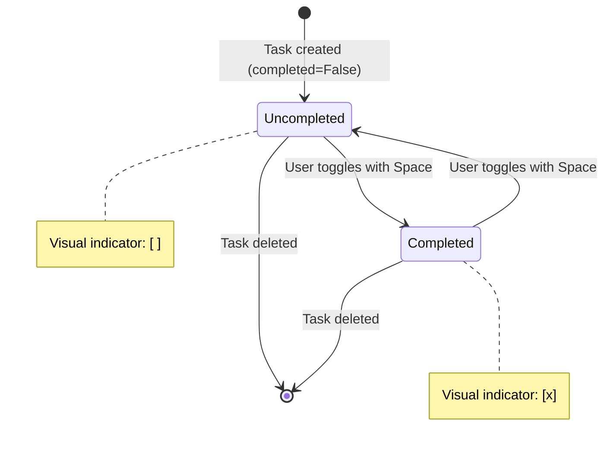

# Data Model: Terminal-based Todo CLI with TUI

**Feature**: 001-todo-cli-tui
**Date**: 2026-01-02
**Phase**: Phase 1 - Design Artifacts

## Overview

This document defines the data model for the Phase 1 Todo CLI application. All data is stored in-memory only and persists only for the duration of the application session.

## Entity: Task

### Description

Represents a single todo item in the user's task list. Tasks have a unique identifier, a text description, and a completion status.

### Attributes

| Attribute | Type | Description | Constraints | Validation |
|-----------|------|-------------|-------------|------------|
| `id` | `int` | Unique identifier for the task | Auto-incrementing, starts at 1 | Required, immutable, unique |
| `description` | `str` | Human-readable task description | 1-1000 characters after stripping | Required, must not be empty or whitespace-only |
| `completed` | `bool` | Task completion status | `True` or `False` | Required, defaults to `False` |

### Python Implementation

```python
from dataclasses import dataclass
from typing import Final

@dataclass(frozen=True)
class Task:
    """Represents a single todo item.

    Attributes:
        id: Unique identifier (auto-incremented)
        description: Task description (1-1000 characters)
        completed: Completion status (defaults to False)
    """
    id: int
    description: str
    completed: bool = False

    # Constants for validation
    MIN_DESCRIPTION_LENGTH: Final[int] = 1
    MAX_DESCRIPTION_LENGTH: Final[int] = 1000

    def __post_init__(self):
        """Validate task constraints after initialization."""
        self._validate_description(self.description)
        self._validate_id(self.id)

    @staticmethod
    def _validate_description(description: str) -> None:
        """Validate task description meets constraints."""
        if not isinstance(description, str):
            raise TypeError("Description must be a string")

        cleaned = description.strip()
        if not cleaned:
            raise ValueError("Task description cannot be empty")
        if len(cleaned) < Task.MIN_DESCRIPTION_LENGTH:
            raise ValueError(
                f"Task description too short "
                f"(min {Task.MIN_DESCRIPTION_LENGTH} character)"
            )
        if len(cleaned) > Task.MAX_DESCRIPTION_LENGTH:
            raise ValueError(
                f"Task description too long "
                f"(max {Task.MAX_DESCRIPTION_LENGTH} characters)"
            )

    @staticmethod
    def _validate_id(id: int) -> None:
        """Validate task ID."""
        if not isinstance(id, int):
            raise TypeError("Task ID must be an integer")
        if id < 1:
            raise ValueError("Task ID must be positive")

    def toggle(self) -> "Task":
        """Return a new Task with completed status toggled.

        Returns:
            A new Task instance with flipped completed status
        """
        return Task(id=self.id, description=self.description, completed=not self.completed)

    def with_description(self, new_description: str) -> "Task":
        """Return a new Task with updated description.

        Args:
            new_description: New description for the task

        Returns:
            A new Task instance with updated description

        Raises:
            ValueError: If new_description fails validation
        """
        return Task(id=self.id, description=new_description, completed=self.completed)
```

### State Transitions



**Transition Rules**:
1. **Creation**: All tasks start in `Uncompleted` state (FR-007)
2. **Toggle**: User can toggle between `Uncompleted` ↔ `Completed` by pressing Space (FR-011)
3. **Delete**: Tasks can be deleted from either state (FR-015, FR-016)
4. **Edit**: Description can be updated from either state (FR-013, FR-014)
5. **Immutability**: Task objects are immutable (frozen dataclass), all operations return new instances

### Visual Representation

When displayed in the task list view:

```
Uncompleted:  [1] Buy groceries
Completed:    [x] Walk the dog
```

- `[ ]` indicates uncompleted (FR-009)
- `[x]` indicates completed (FR-009)
- Number in brackets shows task ID

## Collection: TaskList

### Description

In-memory container for all tasks in the current session. Managed by `TaskService`.

### Implementation

```python
from typing import List, Optional
from dataclasses import field

class TaskService:
    """Manages in-memory task storage and operations."""

    def __init__(self) -> None:
        """Initialize empty task list and ID counter."""
        self._tasks: List[Task] = []
        self._next_id: int = 1

    def create_task(self, description: str) -> Task:
        """Create a new task and add to list.

        Args:
            description: Task description

        Returns:
            Created Task object

        Raises:
            ValueError: If description validation fails
        """
        task = Task(id=self._next_id, description=description.strip(), completed=False)
        self._tasks.append(task)
        self._next_id += 1
        return task

    def get_all_tasks(self) -> List[Task]:
        """Get all tasks in insertion order.

        Returns:
            List of all tasks (copy to prevent external modification)
        """
        return self._tasks.copy()

    def get_task_by_id(self, task_id: int) -> Optional[Task]:
        """Get a specific task by ID.

        Args:
            task_id: Unique task identifier

        Returns:
            Task if found, None otherwise
        """
        for task in self._tasks:
            if task.id == task_id:
                return task
        return None

    def update_task(self, task_id: int, new_description: str) -> Task:
        """Update task description.

        Args:
            task_id: ID of task to update
            new_description: New description

        Returns:
            Updated Task object

        Raises:
            ValueError: If task not found or description invalid
        """
        for i, task in enumerate(self._tasks):
            if task.id == task_id:
                updated_task = task.with_description(new_description)
                self._tasks[i] = updated_task
                return updated_task
        raise ValueError(f"Task {task_id} not found")

    def delete_task(self, task_id: int) -> None:
        """Delete a task by ID.

        Args:
            task_id: ID of task to delete

        Raises:
            ValueError: If task not found
        """
        for i, task in enumerate(self._tasks):
            if task.id == task_id:
                del self._tasks[i]
                return
        raise ValueError(f"Task {task_id} not found")

    def toggle_task_completion(self, task_id: int) -> Task:
        """Toggle task completion status.

        Args:
            task_id: ID of task to toggle

        Returns:
            Updated Task with toggled completion status

        Raises:
            ValueError: If task not found
        """
        for i, task in enumerate(self._tasks):
            if task.id == task_id:
                toggled_task = task.toggle()
                self._tasks[i] = toggled_task
                return toggled_task
        raise ValueError(f"Task {task_id} not found")

    def task_count(self) -> int:
        """Get total number of tasks.

        Returns:
            Count of tasks in list
        """
        return len(self._tasks)

    def is_empty(self) -> bool:
        """Check if task list is empty.

        Returns:
            True if no tasks, False otherwise
        """
        return len(self._tasks) == 0
```

### Operations Summary

| Operation | Method | Time Complexity | Returns |
|-----------|--------|-----------------|---------|
| Create Task | `create_task()` | O(1) | New `Task` |
| List All | `get_all_tasks()` | O(n) | `List[Task]` |
| Get by ID | `get_task_by_id()` | O(n) | `Optional[Task]` |
| Update Description | `update_task()` | O(n) | Updated `Task` |
| Delete | `delete_task()` | O(n) | `None` |
| Toggle Completion | `toggle_task_completion()` | O(n) | Updated `Task` |
| Count | `task_count()` | O(1) | `int` |
| Is Empty | `is_empty()` | O(1) | `bool` |

**Note**: O(n) operations are acceptable for the expected scale (10-100 tasks per spec SC-003).

## Validation Rules Summary

### Task Description

- **Type**: Must be string
- **Empty Check**: After stripping whitespace, must have at least 1 character
- **Minimum Length**: 1 character (FR-023)
- **Maximum Length**: 1000 characters (edge case handling)
- **Whitelisting**: No character restrictions (allow Unicode, emojis, etc.)

### Task ID

- **Type**: Must be integer
- **Range**: Must be positive (>= 1)
- **Uniqueness**: Guaranteed by auto-increment counter
- **Immutability**: ID never changes after creation

### Completion Status

- **Type**: Must be boolean
- **Default**: False (uncompleted) for all new tasks (FR-007)
- **Source of Truth**: Stored in Task.completed field

## Error Conditions

| Error | Condition | Recovery |
|-------|-----------|----------|
| `ValueError: "Task description cannot be empty"` | User provides empty/whitespace-only description | Show error, prompt again |
| `ValueError: "Task description too long"` | Description exceeds 1000 characters | Truncate or prompt again |
| `ValueError: "Task {id} not found"` | Attempt to update/delete non-existent task | Show error, return to list |
| `TypeError: "Description must be a string"` | Non-string passed to Task constructor | Show error, prompt again |

## In-Memory Storage Constraints

Per constitution Principle I and FR-019, FR-020, FR-021:

- **No Persistence**: Tasks are stored in `List[Task]` in memory only
- **Session Lifetime**: All task data exists only during application runtime
- **No Files**: No writing to disk, database, or external storage
- **Data Loss**: All tasks are lost when application exits (expected behavior)
- **Single Instance**: Only one TaskService instance exists per application

## Testing Considerations

### Unit Tests for Task Model

- Test validation with empty description
- Test validation with whitespace-only description
- Test validation with very long description
- Test validation with invalid types
- Test `toggle()` method
- Test `with_description()` method
- Test immutability (frozen dataclass)

### Unit Tests for TaskService

- Test create_task increments ID
- Test create_task validates description
- Test get_all_tasks returns copy (not internal list)
- Test get_task_by_id with valid/invalid IDs
- Test update_task modifies correct task
- Test delete_task removes correct task
- Test toggle_task_completion flips status
- Test is_empty with zero/non-zero tasks
- Test task_count accuracy

## Next Steps

1. ✅ Data model defined
2. ⏳ Implement Task class in `cli/models/task.py`
3. ⏳ Implement TaskService in `cli/services/task_service.py`
4. ⏳ Write unit tests for Task and TaskService
5. ⏳ Create quickstart.md (development setup guide)
